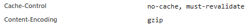
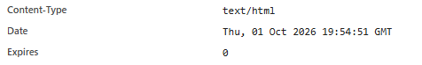
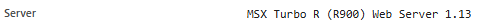
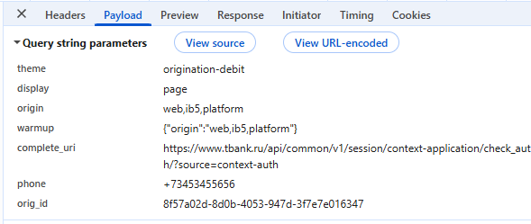
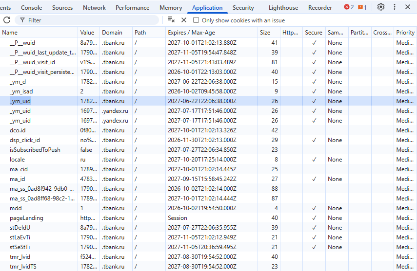
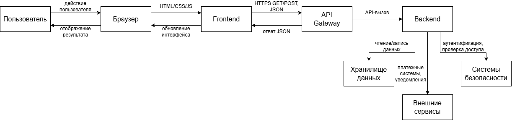
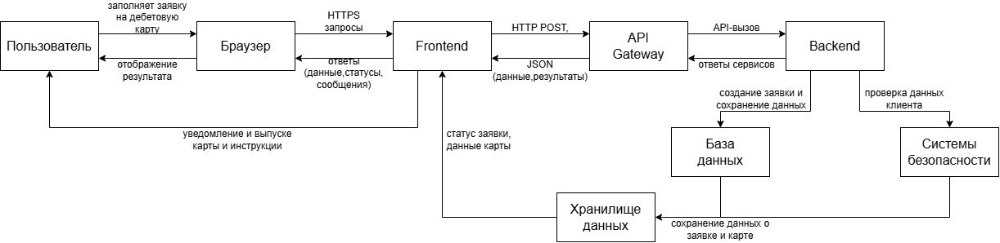

# Анализ веб-приложения и клиент-серверного взаимодействия

## 1. Исследуемая информационная система

Для выполнения лабораторной работы был выбран сервис Т-Банк и пользовательский сценарий: оформление дебетовой карты.

Т-Банк - это экосистема финансовых сервисов, предоставляющая доступ к банковским продуктам через веб-интерфейс. Пользователь работает через браузер, который отправляет защищенные запросы к серверам банка, а серверы возвращают данные о счетах, продуктах и статусах операций, обновляя состояние интерфейса в реальном времени.

В ходе исследования были выделены следующие основные компоненты:
 - браузер пользователя
 - интерфейс сайта (fronted), отображающая графики, формы и данные о продуктах
 - клиентский JavaScript
 - API-сервис, принимающий запросы от клиента, обеспечивающий первичную проверку безопасности
 - backend, реализующий бизнес-логику
 - хранилище данных, в котором хранятся профили клиентов, транзакции и настройки продуктов
 - внешние сервисы и ресурсы

### 1.1. Сценарий исследования

Исследуемый сценарий:

1. Авторизация в личном кабинете Т-Банка.
2. Переход в раздел "Дебетовые карты" из выпадающего меню.
3. Заполнение анкетных данных.
4. Выбор способа получения карты.
5. Подтверждение выпуска карты.
6. Проверка отображения новой карты в личном кабинете.

## 2. Анализ HTTP-запросов

В работе для изучения сетевого взаимодействия использовалась вкладка Network в браузерных DevTools. Перед началом сценария (оформление дебетовой карты) список запросов был очищен, после чего были выполнены действия, связанные с заполнением заявки и выпуском карты. В результате удалось наблюдать сетевые обращения, которые обеспечивали загрузку интерфейса, валидацию данных и передачу заявки на сервер.

### 2.1. Основные наблюдения

Во время исследования были замечены следующие типы HTTP-запросов:
 - GET-запросы для загрузки HTML, CSS, JavaScript и изображений 
 - POST-запросы для отправки персональных данных и подтверждения операций
 - запросы на получение/обновление данных о продуктах, тарифах и статусе заявки
 - служебные запросы, связанные с сессией, аутентификацией (Tinkoff ID) и аналитикой

### 2.2. Таблица HTTP-запросов

Ниже приведены типичные запросы, обнаруженные в ходе исследования.

| Метод | URL/тип запроса                                    | Статус | Назначение                                     |
|-------|----------------------------------------------------|--------|------------------------------------------------|
|GET    | /cards/debit-cards/                                | 200    | Загрузка страницы с описанием дебетовой карты  |
| GET   | https://static.tbank.ru/frontend/js/main.bundle.js | 200    | Загрузка JavaScript фронтенда                  |
| GET   | /api/v1/products/rates?city=msk                    | 200    | Загрузка списка доступных тарифов и условий    |
| POST  | /api/v1/application/create/	                     | 200    | Создание черновика заявки на карту             |
| POST  | /api/v1/application/validate/                      | 200    | Валидация введенных паспортных данных          |
| POST  | /api/v1/application/submit/                        | 200    | Отправка финальной заявки на выпуск карты      |

### 2.3. Запросы, относящиеся к пользовательскому сценарию

К выбранному сценарию относятся те запросы, которые были запущены после нажатия на кнопку «Оформить карту» и последующей отправки анкетных данных. В частности, после активации элемента интерфейса браузер инициировал запрос на создание и валидацию заявки. Это подтверждает, что интерфейс работает не локально, а через сетевой обмен данными с сервером.

Наблюдаемый факт: после действия «Отправить заявку» в DevTools появился HTTP POST-запрос, который связан с передачей персональных данных и запуском процесса выпуска карты.

Предположение: запрос обрабатывается API-сервисом, который затем передает данные в скоринговую систему и возвращает обновленный статус заявки (например, «Одобрено» или «На рассмотрении»).

## 3. Анализ HTTP-ответов

После выполнения запроса сервер возвращает HTTP-ответ, в котором содержатся статус-код, заголовки и тело ответа. Для анализа были выбраны два запроса: один на загрузку страницы с формой заявки и один на отправку анкетных данных для выпуска карты.

### 3.1. Пример анализа ответа на запрос страницы

Для запроса загрузки страницы оформления дебетовой карты был получен ответ со статусом 200 OK. Это указывает на успешную загрузку HTML-документа, после чего браузер начал рендерить интерфейс формы и подгружать сопутствующие скрипты.

Основные наблюдаемые заголовки:
 - Content-Type: text/html или application/json
 - Cache-Control: политика кэширования содержимого
 - Expires: политика кэширования содержимого
 - Date: дата и время ответа
 - Server: название серверного программного обеспечения

Тело ответа представляло HTML-страницу или данные страницы (JSON), необходимые для инициализации формы оформления карты и отображения текущих тарифов.

### 3.2. Пример анализа ответа на запрос отправки заявки

Для API-запроса, связанного с финальным подтверждением выпуска дебетовой карты, был получен ответ со статусом 200 или 201, что соответствует успешной операции. Это означает, что сервер подтвердил выполнение действия (карта выпущена или заявка одобрена) и передал результат в формате JSON.

## Анализ параметров и передаваемых данных

При выполнении пользовательского сценария браузер передавал серверу информацию, которая позволяла понять, какие данные были введены в форму и на каком этапе находится процесс оформления картыю

### 4.1. Параметры запроса

В запросах, связанных с оформлением дебетовой карты, можно выделить следующие этапы:

В теле запроса:
 - данные заполненной заявки
 - выбранные параметры карты и дополнительные опции
 - сведения, необходимые для обработки заявки

В заголовках:
 - версия браузера
 - время операции
 - тип передаваемых данных
 - данные сессии

### 4.2. Где находятся данные

Параметры распределены следующим образом:
 - часть данных - в URL-параметрах query string
 - основная часть данных - в теле HTTP-запроса
 - служебные данные - в cookie и заголовках запроса

Пример структуры данных в body запроса:

 theme=
 display=
 origin=
 warmup=
 complete_uri=
 phone=
 orig_id=

### 4.3. Какие данные передаются при заполнении данных

При заполнении данных сервер получает:
 - какой тип дебетовой карты
 - персональные данные

В ответе сервер возвращает результат операции и обновленные данные формы/шага, чтобы пользователь видел измененное состояние без перезагрузки страницы.

## 5. Анализ cookies

Cookies используются в веб-приложениях для хранения небольших данных, которые браузер должен отправлять серверу при последующих запросах. На сайте Т-Банка это может использоваться для авторизации, идентификации сессии, аналитики и хранения пользовательских настроек.

| Имя cookie   | Домен      | Срок действия    | Назначение                                                                    | Флаги   |
|--------------|------------|------------------|-------------------------------------------------------------------------------|---------|
| __P__wuid    | .tbank.ru  | Длительный срок  | Внутренняя идентификация пользователя                                         | Secure  |
| _ym_d        | .tbank.ru  | Длительный срок  | Хранение даты первого посещения сайта пользователем                           | Secure  |
| pageLanding  | .tbank     | Сессия           | Обеспечивают базовую работу сайта, упрощают взаимодействие пользователя с ним | Secure  |
| Locale       | .tbank.ru  | Длительный срок  | Запоминание языковых и региональных предпочтений пользователя на сайте        | Secure  |
| _ym_uid      | .tbank.ru  | Длительный срок  | Присваивание каждому посетителю уникальный идентификатор                      | Secure  |

### 5.2. Анализ результатов

Наблюдаемый факт: на сайте Т-Банка используются cookies, которые автоматически отправляются браузером вместе с запросамик доменам сервиса.

Предположение:
 - часть cookies отвечает за аудентификацию, безопасную идентификацию пользователя 
 - часть cookies используется для аналитики
 - часть cookies хранит клиентские настройки интерфейса и локализацию

## 6. Взаимодействие Frontend, API и Backend

Для выбранного пользовательского сценария важным является понимание цепочки событий от действий пользователя до визуального обновления интерфейса.

### 6.1. Последовательность событий

 - пользователь
 - интерфейс формы оформления карты
 - JavaScript / frontend-логика
 - HTTP-запрос к API
 - Backend-сервис
 - Обработка и сохранение данных
 - HTTP-ответ
 - Обновление интерфейса
 - пользователь видит новый шаг на странице

### 6.2. Конкретное действие

Рассмотрим действие: пользователь заполнил персональные данные и нажимает кнопку "Оформить карту".

1. Пользователь взаимодействует с UI-элементом формы
2. Frontend реагирует на действие и формирует HTTP-запрос
3. Браузер отправляет запрос на API-адрес 
4. API принимает запрос и шлёт его на backend
5. Backend обрабатывает данные: проверяет корректность заполнения, создает заявку в базе данных и формирует SMS-код подтверждения
6. Сервер возвращает ответ со статусом успеха
7. JavaScript frontend получает ответ и обновляет визуальную структуру страницы-переключает экран формы на шаг ввода SMS-кода
8. Пользователь видит следующий шаг оформления

### 6.3. Вывод по архитектуре

В результате исследования было подтверждено, что взаимодействие между клиентом и сервером происходит через HTTP. Браузер не хранит состояние страницы в единственном локальном файле; он получает и отправляет данные через API, что позволяет приложению обновлять интерфейс динамически, без полной перезагрузки страницы.

## 7. Сопоставление с архитектурой из лабораторной работы №1

По результатам первой лабораторной работы была построена предварительная архитектурная схема системы. Во второй лабораторной она была сопоставлена с реальным сетевым поведением приложения.

### 7.1. Что удалось подтвердить

Были подтверждены следующие элементы архитектуры:
 - браузер пользователя является входной точкой взаимодействия
 - frontend загружает интерфейс, обрабатывает действия пользователя и формирует HTTP-запросы
 - API участвует в обмене данными между клиентом и сервером
 - backend отвечает за обработку запросов и обновление состояния страницы
 - данные сохраняются в хранилище данных, а не только в памяти браузера
 - cookies используются для поддержания пользовательской сессии и некоторой служебной информации

### 7.2. Что остается предположительным

Некоторые элементы архитектуры не были видны напрямую из DevTools (в целях безопасности банка), поэтому они остаются предположениями:
 - на каком языке реализован backend
 - используется ли отдельный API gateway
 - какая часть обработки вынесена во внешние сервисы
 - есть ли кеширование на стороне сервера или CDN

### 7.3. Дополнение архитектурной схемы

После исследования стало понятно, что взаимодействие идет по следующей схеме:
 - пользователь
 - браузер
 - Frontend
 - API Gateway
 - Backend
 - хранилище данных

и при необходимости возможно присутствие внешних сервисов для аналитики, CDN и авторизации.

Архитектурная схема Т-Банка

## 8. Схема взаимодействия компонентов

На основании проведенного анализа была построена отдельная схема взаимодействия компонентов для сценария оформления дебетовой карты.

Схема взаимодействия для сценария: оформление дебетовой карты

На схеме отражены:
 - пользователь
 - браузер
 - frontend
 - API
 - backend
 - хранилище данных
 - направление обмена данными
 - HTTP-запросы и HTTP-ответы
 - JSON-передача данных
 - обновление интерфейса после ответа сервера

## 9. Вывод

В ходе лабораторной работы было проведено исследование HTTP-взаимодействия в веб-приложении Т-Банка на выбранном сценарии «Оформление дебетовой карты». Было установлено, что интерфейс работает через клиентский JavaScript, который отправляет HTTP-запросы к серверу, а сервер отвечает данными и статусами выполнения операции.

Были выявлены следующие важные результаты:
 - браузер и frontend тесно взаимодействуют для обработки пользовательского действия
 - запросы к API выполняются при загрузке страницы, при валидации полей формы и при отправке финальной заявки
 - оформление карты сопровождается HTTP POST-запросом и ответом сервера
 - данные передаются в теле запроса, а также сохраняются в cookies для поддержания сессии и сохранения прогресса заполнения
 - обратно пользователю приходит результат, который обновляет интерфейс без полной перезагрузки страницы

Главный вывод состоит в том, что современное веб-приложение банка является распределенной системой: пользователь взаимодействует с UI, frontend формирует сеть запросов, API организует обмен данными, а backend обрабатывает их и сохраняет состояние. Важным является также разделение фактов и предположений: факты подтверждены в DevTools, а предположения обозначены как гипотезы, поскольку без доступа к серверной части нельзя установить внутреннюю реализацию с абсолютной уверенностью.

### 9.1. Результаты работы

Подтверждено: наличие HTTP-запросов при работе с формой оформления карты.
Подтверждено: наличие API-взаимодействия между frontend и backend.
Подтверждено: использование cookies и заголовков HTTP для поддержания сессии и передачи данных.
Подтверждено: обновление интерфейса после получения ответа сервера.

В результате лабораторной работы была оформлена в виде отчета с описанием сетевого взаимодействия, таблицами запросов, анализом параметров и cookies, а также архитектурной схемой сценария.
